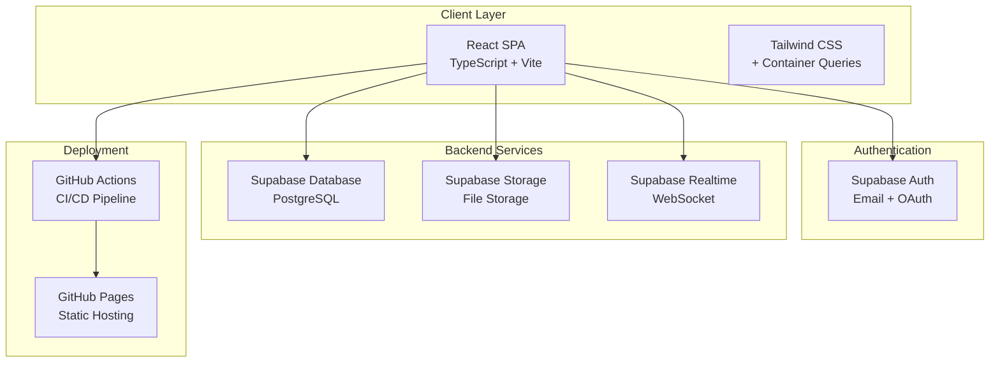

# 🌊 Moonwave SMS V.2.0
> Subscription Management System - 개인 맞춤 구독관리 서비스

[](https://your-username.github.io/moonwave-v2)
[](https://reactjs.org/)
[](https://www.typescriptlang.org/)
[](https://tailwindcss.com/)
[](https://supabase.com/)

## 📋 목차

- [프로젝트 개요](#-프로젝트-개요)
- [주요 기능](#-주요-기능)
- [기술 스택](#-기술-스택)
- [시스템 아키텍처](#-시스템-아키텍처)
- [시작하기](#-시작하기)
- [개발 환경 설정](#-개발-환경-설정)
- [디자인 시스템](#-디자인-시스템)
- [데이터베이스 구조](#-데이터베이스-구조)
- [개발 로드맵](#-개발-로드맵)
- [기여하기](#-기여하기)
- [라이선스](#-라이선스)

## 🎯 프로젝트 개요

Moonwave SMS는 사용자가 본인의 정기구독(서비스, 상품, 결제 등) 현황을 쉽고 효율적으로 관리할 수 있는 **완전 무료** 구독관리 서비스입니다.

### 핵심 가치
- **개인 맞춤**: 유저별 완전 분리된 개인 데이터
- **완전 무료**: 유료/프리미엄/광고 없음
- **단순/직관/효율**: 최소한의 클릭으로 최대한의 기능

### 주요 특징
- 🔐 **개인 전용**: 로그인 유저만 접근, 유저간 데이터 공유 불가
- 💳 **직접 입력**: 구독 서비스 마스터 DB 없음, 사용자 직접 관리
- 🎨 **모던 UI**: Utility-First CSS, 아이콘 중심 인터페이스
- 📱 **반응형**: 모바일 우선 설계, Container Queries 활용
- 🌐 **다국화**: 한글 최적화, Pretendard 폰트 적용

## ✨ 주요 기능

### 📊 대시보드 & 통계
- 총 구독 서비스 수 및 월별 비용 현황
- 원화/달러 분리 표시 및 환율 적용 자동 계산
- 활성/해지 구독 상태별 관리

### 💳 구독 카드 관리
- **기본 정보**: 서비스명, URL, 로고 이미지
- **결제 정보**: 금액, 통화(KRW/USD), 결제 주기, 결제일
- **부가 정보**: 카테고리, 결제수단, 티어/등급, 혜택, 태그, 메모
- **상태 관리**: 활성/해지, 자동갱신, 시작일/만료일

### 📅 결제 캘린더
- 달력 UI로 결제일 시각화
- 오늘/이번 주 결제 예정 강조 표시
- 일자별 구독 상세 정보 팝업

### 🔔 스마트 알림
- **알림 종류**: 결제 예정, 자동 연장, 만료/해지, 결제 실패
- **알림 설정**: N일 전/당일, 개별 ON/OFF 설정
- **맞춤 알림**: 가격 변동, 혜택 만료 등

### 🔍 검색 & 필터
- 서비스명, 카테고리, 결제수단별 필터링
- 결제일, 금액순 정렬
- 카드형/그리드형 리스트 뷰

## 🛠 기술 스택

### Frontend
- **Framework**: React 18.2.0 + TypeScript 5.2.2
- **Build Tool**: Vite 5.0.8
- **Styling**: Tailwind CSS 3.3.0 + Container Queries
- **UI Components**: Radix UI + Headless UI
- **Icons**: Radix Icons + Lucide React + Heroicons
- **Typography**: Pretendard Variable Font

### Backend (Serverless)
- **BaaS**: Supabase
  - PostgreSQL Database
  - Authentication (Email + Google OAuth)
  - File Storage
  - Realtime Subscriptions
  - Row Level Security (RLS)

### DevOps & Deployment
- **Version Control**: Git + GitHub
- **CI/CD**: GitHub Actions
- **Hosting**: GitHub Pages (Static)
- **Domain**: Custom Domain (`xxx.moonwave.kr`)

### Development Tools
- **IDE**: Cursor (AI-powered)
- **Package Manager**: npm
- **Code Quality**: TypeScript, ESLint, Prettier
- **Testing**: Vitest + React Testing Library

## 🏗 시스템 아키텍처



### 핵심 설계 원칙
- **Serverless First**: 서버 관리 없는 BaaS 활용
- **Static Deployment**: 정적 배포로 비용 효율성 극대화
- **Type Safety**: TypeScript로 전체 타입 안전성 보장
- **Utility-First CSS**: Tailwind CSS로 일관된 디자인 시스템
- **User Isolation**: 유저별 데이터 완전 분리

## 🚀 시작하기

### 필수 요구사항
- Node.js 18.0 이상
- npm 9.0 이상
- Git
- Supabase 계정

### 빠른 시작
```bash
# 1. 저장소 클론
git clone https://github.com/your-username/moonwave-v2.git
cd moonwave-v2

# 2. 의존성 설치
npm install

# 3. 환경 변수 설정
cp .env.example .env.local
# .env.local 파일에 Supabase 키 입력

# 4. 개발 서버 실행
npm run dev
```

브라우저에서 `http://localhost:5173`을 열어 애플리케이션을 확인할 수 있습니다.

## ⚙️ 개발 환경 설정

### 환경 변수 설정
```env
# .env.local
VITE_SUPABASE_URL=https://your-project.supabase.co
VITE_SUPABASE_ANON_KEY=your_anon_key
```

### Supabase 설정
1. [Supabase](https://supabase.com)에서 새 프로젝트 생성
2. Database 스키마 설정 (ERD 참조)
3. Authentication 설정 (이메일 + Google OAuth)
4. Storage 버킷 생성 (서비스 로고 이미지용)
5. RLS 정책 설정 (보안)

### 프로젝트 구조
```
src/
├── components/          # React 컴포넌트
│   ├── ui/             # 기본 UI 컴포넌트
│   ├── layout/         # 레이아웃 컴포넌트
│   └── features/       # 기능별 컴포넌트
├── contexts/           # React Context
├── hooks/              # Custom Hooks
├── lib/                # 유틸리티 및 설정
├── pages/              # 페이지 컴포넌트
├── types/              # TypeScript 타입 정의
└── utils/              # 공통 유틸리티
```

### 개발 스크립트
```bash
# 개발 서버 실행
npm run dev

# 프로덕션 빌드
npm run build

# 빌드 결과 미리보기
npm run preview

# 코드 검사
npm run lint

# 타입 검사
npm run type-check
```

## 🎨 디자인 시스템

### 디자인 원칙
- **Utility-First CSS**: 사전 정의된 유틸리티 클래스로 커스텀 디자인 구축
- **Component Abstraction**: 반복되는 패턴을 컴포넌트로 추상화
- **Icon-Only Interface**: 텍스트 없이 아이콘만으로 명확한 의미 전달
- **Premium Components First**: Tailwind UI 프리미엄 컴포넌트 우선 활용

### 색상 시스템
```css
/* Primary Colors */
--blue-500: #3b82f6;
--blue-600: #2563eb;
--purple-600: #9333ea;

/* Gradients */
--gradient-primary: linear-gradient(to right, #3b82f6, #9333ea);
--gradient-bg: linear-gradient(to bottom right, #dbeafe, #ffffff, #faf5ff);
```

### 타이포그래피
- **기본 폰트**: Pretendard Variable
- **한글 최적화**: `break-keep-ko`, `tracking-ko-normal`
- **크기 체계**: text-sm (14px) → text-base (16px) → text-lg (18px)

### 컴포넌트 라이브러리
자세한 컴포넌트 사용법은 [컴포넌트 라이브러리 문서](docs/컴포넌트%20라이브러리)를 참조하세요.

## 🗄 데이터베이스 구조

### 핵심 테이블

#### subscriptions (구독 서비스)
```sql
CREATE TABLE subscriptions (
    id UUID PRIMARY KEY,
    user_id UUID REFERENCES auth.users(id),
    service_name TEXT NOT NULL,
    service_url TEXT,
    service_image_url TEXT,
    amount NUMERIC(12,2) NOT NULL,
    currency TEXT CHECK (currency IN ('KRW', 'USD')),
    payment_cycle TEXT CHECK (payment_cycle IN ('monthly', 'yearly', 'once')),
    payment_day INTEGER CHECK (payment_day >= 1 AND payment_day <= 31),
    status TEXT DEFAULT 'active',
    start_date DATE,
    next_payment_date DATE,
    auto_renewal BOOLEAN DEFAULT true,
    created_at TIMESTAMPTZ DEFAULT NOW()
);
```

#### exchange_rates (환율 정보)
```sql
CREATE TABLE exchange_rates (
    user_id UUID PRIMARY KEY REFERENCES auth.users(id),
    usd_to_krw NUMERIC(8,2) DEFAULT 1300.00,
    updated_at TIMESTAMPTZ DEFAULT NOW()
);
```

### 보안 정책 (RLS)
모든 테이블에 Row Level Security가 적용되어 사용자별 데이터 완전 분리를 보장합니다.

자세한 ERD는 [데이터베이스 문서](docs/ERD)를 참조하세요.

## 📋 개발 로드맵

### Phase 1: 기반 구축 (1-2주)
- [x] 프로젝트 초기 설정
- [x] Supabase 연동
- [x] 기본 인증 시스템
- [x] 디자인 시스템 구축
- [ ] 기본 컴포넌트 라이브러리

### Phase 2: 핵심 기능 (2-3주)
- [ ] 구독 카드 CRUD
- [ ] 대시보드 통계
- [ ] 결제 캘린더
- [ ] 검색 및 필터링
- [ ] 환율 관리

### Phase 3: 고급 기능 (2-3주)
- [ ] 알림 시스템
- [ ] 파일 업로드 (로고 이미지)
- [ ] 카테고리 관리
- [ ] 데이터 내보내기
- [ ] 다크 모드

### Phase 4: 최적화 & 배포 (1-2주)
- [ ] 성능 최적화
- [ ] 접근성 개선
- [ ] PWA 지원
- [ ] 프로덕션 배포
- [ ] 도메인 연결

자세한 체크리스트는 [개발 계획서](docs/Phase별%20개발%20작업을%20체계적인%20체크리스트)를 참조하세요.

## 📚 문서

- [📋 PRD (Product Requirements Document)](docs/PRD)
- [🏗 기술 아키텍처](docs/기술%20아키텍처)
- [⚙️ 개발 환경 가이드](docs/개발%20환경%20통합%20가이드)
- [🎨 디자인 시스템](docs/디자인가이드)
- [🧩 컴포넌트 라이브러리](docs/컴포넌트%20라이브러리)
- [🖼️ 화면 정의서](docs/화면정의서)
- [🗄 데이터베이스 ERD](docs/ERD)
- [👆 로그인/회원가입 가이드](docs/로그인%20회원가입%20디자인%20가이드)
- [🦶 Footer 디자인 가이드](docs/Footer%20디자인가이드)

## 🤝 기여하기

### 개발 워크플로우
1. Issue 생성 또는 확인
2. Feature 브랜치 생성 (`feature/기능명`)
3. 개발 및 테스트
4. Pull Request 생성
5. 코드 리뷰 및 머지

### 커밋 컨벤션
```
feat: 새로운 기능 추가
fix: 버그 수정
docs: 문서 수정
style: 코드 스타일 변경 (포맷팅 등)
refactor: 코드 리팩토링
test: 테스트 코드 추가/수정
chore: 빌드 스크립트, 패키지 매니저 등
```

### 코드 스타일
- TypeScript 사용 필수
- Tailwind CSS 유틸리티 클래스 우선
- 컴포넌트별 파일 분리
- JSDoc 주석 권장

## 📄 라이선스

이 프로젝트는 [MIT License](LICENSE) 하에 배포됩니다.

## 👥 팀

- **기획/디자인**: 문유 [@문유](https://github.com/your-username)
- **개발**: Cursor AI 협업

## 📞 연락처

- **이슈 및 버그 리포트**: [GitHub Issues](https://github.com/your-username/moonwave-v2/issues)
- **이메일**: your-email@domain.com
- **웹사이트**: [moonwave.kr](https://moonwave.kr)

---

<div align="center">

**Made with ❤️ by Moonwave Team**

[🏠 홈페이지](https://moonwave.kr) • [📚 문서](docs/) • [🐛 버그 리포트](https://github.com/your-username/moonwave-v2/issues) • [💡 기능 제안](https://github.com/your-username/moonwave-v2/discussions)

</div>
